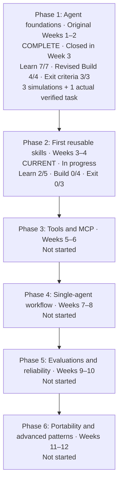

# AI Agent Learning and Skill-Development Roadmap

Calendar: Jalali (Solar Hijri), YYYY-MM-DD.

This is my personal, living roadmap for learning how AI agents work while building reusable skills for Codex, GPT-based agents, OpenCode, and other compatible tools.

## Current status

- Start date: 1405-06-09
- Target duration: 12 weeks
- Current phase: Phase 2 — First reusable skills (in progress)
- Overall progress: Phase 1 complete under its revised Build scope: 7/7 learning outcomes, 4/4 Build outcomes including 3 guided simulations (Practiced), and 3/3 exit criteria. Actual task-renaming execution and learner acceptance review are complete. No overall percentage assigned.
- Weekly study/build ratio: 30% study, 70% practice
- Next review date: 1405-07-05 (Week 4 checkpoint; Jalali, Asia/Tehran). The 1405-06-29 Week 3 checkpoint is overdue.
- Current evidence: Phase 1 outcomes, Phase 2 discovery/triggering, independent trigger-condition authoring, and stage-specific lifecycle evidence reasoning: Demonstrated. The first recording-auditor contract and three cases are drafted with coaching (Practiced). [Contract report](reports/1405-07-04-recording-lifecycle-contract.md)
- Next checkpoint: Complete the overdue capacity review, then study skill file organization and progressive disclosure before implementing the first skill.
- Periodic review: Six-question review completed on 1405-06-22; 6/6 correct. Component explanation and actual bounded-task acceptance subsequently demonstrated; Phase 1 closed on 1405-06-25. Recheck preservation and evidence sufficiency during the first Phase 2 skill evaluation; next phase-boundary review at the end of Phase 2. See [review](reports/1405-06-22-phase-1-periodic-review.md) and [completion](reports/1405-06-25-phase-1-completed.md).
- Current phase progress: Phase 2 Learn 2/5 (discovery/triggering and condition authoring demonstrated); Build 0/4; required-content checklist 0/8; Exit criteria 0/3. Phase 1 finished at Learn 7/7; revised Build 4/4; Exit 3/3.
- Schedule status: Behind. Week 3 had 1/3 targets met by 1405-06-29; all 3/3 are now complete after two late completions. The capacity review remains overdue, and Week 4 targets remain 0/4 with the checkpoint on 1405-07-05.
- Evidence trend: Phase 1 complete; Phase 2 triggering and stage-specific evidence reasoning demonstrated. One real skill contract and three evaluation cases are drafted with coaching; implementation and execution remain pending. Across 21 reports (1405-06-10 to 1405-07-04). [Contract report](reports/1405-07-04-recording-lifecycle-contract.md)

## Priority review: build templates and worked examples

**Starred by the learner for future review — 1405-06-19 (Jalali; Asia/Tehran).** The learner finds the build templates and concrete samples especially useful. Prioritize these when reviewing or preparing practical work; this is a learning preference, not a new assessment result.

| Priority material | Direct links | When to revisit |
|---|---|---|
| **Build 1 — reusable task-request template** | [Template](notes/task-specification-and-verification.md#combined-reusable-request-draft) · [Book-search example](notes/task-specification-and-verification.md#applied-build-practice-book-search-request) · [Reservation example](notes/task-specification-and-verification.md#applied-build-practice-reservations) | Before assigning a bounded coding task; adapt scope, expected behavior, and verification to the new request |
| **Build 2 — reusable code-review checklist** | [Final checklist](notes/reviewing-diffs-and-evidence.md#final-reusable-code-review-checklist) · [Username example and feedback](notes/reviewing-diffs-and-evidence.md#username-review-practice-first-response) · [Fix-versus-verify example](notes/reviewing-diffs-and-evidence.md#how-to-use-the-decision-rule) | Before accepting an agent's code change; compare requirements, changes, and actual evidence |

Future review approach: start with a saved template and one worked example, then apply it to a small new case if the learner wants practice. Keep useful templates and examples easy to find as later build items are completed. Earlier practice labels are historical; Builds 1, 2, and 3 are completed writing outcomes with coaching.

**Paused here:** Phase 2 Learn 2/5; the first contract and three cases are drafted at Practiced level. Next: capacity review, then file organization and progressive disclosure. [Contract report](reports/1405-07-04-recording-lifecycle-contract.md)

## Visual progress roadmap

Snapshot: 1405-07-04 (Jalali; Asia/Tehran). Phase labels retain the original planned sequence; the weekly targets below define the current schedule. Status comes from the phase checkboxes and latest session evidence; no overall percentage is assigned.



### Phase 1 detail

Legend: ✓ Completed or demonstrated · ◐ In progress · ○ Not completed.

| Area | Visual progress | Recorded status |
|---|---|---|
| Learning outcomes | ✓ ✓ ✓ ✓ ✓ ✓ ✓ | 7/7 demonstrated |
| Build outcomes | ✓ ✓ ✓ ✓ | 4/4 revised outcomes complete; simulations Practiced |
| Exit criteria | ✓ ✓ ✓ | 3/3 demonstrated |

| Build item | Status | Remaining work |
|---|---|---|
| 1. Reusable task-request template | ✓ Completed | Independent verification design remains a separate practice target |
| 2. AI-generated-code review checklist | ✓ Completed | Actual bounded-task acceptance demonstrated; recheck transfer in the first Phase 2 evaluation |
| 3. Draft project-independent agent operating instructions | ✓ Completed | Draft reviewed; writing outcome demonstrated without installation |
| 4. Three bounded task-specification/review simulations | ✓ Completed with coaching | Simulations complete; separate actual task-renaming execution and learner acceptance also complete |

The periodic review supports choosing correction for a known defect and checks for missing evidence. Actual task-renaming review now demonstrates acceptance tied to full coverage. Revisit both decisions in a fresh Phase 2 evaluation; independent test design remains a practice target.

Evidence: [Phase 1 completion](reports/1405-06-25-phase-1-completed.md) · [Simulation completion](reports/1405-06-21-build-simulations-completed.md) · [Late fees](experiments/hypothetical-task-1.md) · [Shipping](experiments/hypothetical-task-2.md) · [Renaming](experiments/hypothetical-task-3.md) · [Strengths and gaps](reviews/strengths-and-gaps.md).

This is a saved snapshot. Refresh it alongside future roadmap status updates.

## Learning coach

- Skill: `agent-learning/skills/codex/agent-learning-coach/`
- Suggested invocation: `Use $agent-learning-coach to continue my roadmap.`
- Supervision model: infer progress from recorded evidence, confirm the position with me, teach documented gaps, reassess adaptively, and update progress only from demonstrated evidence.
- Gap notes: `learner/reza/notes/`
- Session reports: `learner/reza/reports/`
- Detailed step plans: `learner/reza/plans/`
- Exercises and artifacts: `learner/reza/experiments/`

## Main goals

- [x] Understand the main components of an AI agent. — See [component explanation](reports/1405-06-23-agent-components.md).
- [ ] Learn the difference between instructions, skills, tools, MCP servers, memory, and agents.
- [ ] Create reusable skills using a portable-core and platform-adapter approach.
- [ ] Build a small tool-using agent for a real project workflow.
- [ ] Measure skill and agent reliability with repeatable evaluations.
- [ ] Test selected skills with at least two agent environments.

## Working principles

1. Build narrow, testable skills instead of one large general-purpose skill.
2. Keep reusable workflow knowledge platform-neutral where practical.
3. Add a thin adapter for each agent platform only when necessary.
4. Treat scripts and tests as part of a skill, not just its written prompt.
5. Never trust a skill based only on one successful demonstration; evaluate it with multiple cases.
6. Prefer one observable agent with good tools before introducing multi-agent orchestration.

## Recommended directory structure

```text
agent-learning/
├── ROADMAP.md
├── notes/
├── experiments/
├── shared/
│   ├── references/
│   ├── scripts/
│   └── evals/
└── skills/
    ├── portable/
    ├── codex/
    ├── opencode/
    └── other-agents/
```

Create these subdirectories only when they are needed.

## Phase 1 — Agent foundations (Weeks 1–2)

### Learn

- [x] Explain the agent loop: observe, reason, act, inspect the result, and repeat.
- [x] Understand model context windows and instruction priority.
- [x] Understand prompts, persistent instructions, and repository instructions.
- [x] Learn how tools extend an agent beyond text generation.
- [x] Learn permissions, sandboxing, approvals, and destructive-action safety.
- [x] Practice defining task scope, constraints, and acceptance criteria.
- [x] Practice reviewing agent-generated diffs and verification evidence.

### Build

- [x] Write a reusable task-request template. — Writing criterion met through learner-authored draft and revisions with feedback; see `notes/task-specification-and-verification.md` and `reports/1405-06-17-task-request-template.md`. Independent verification design remains Practiced.
- [x] Write a checklist for reviewing AI-generated code. — Writing criterion met by the learner-authored draft and application, consolidated with coach refinements; see `notes/reviewing-diffs-and-evidence.md` and `reports/1405-06-19-code-review-checklist-completed.md`. Practical evidence-aware acceptance demonstrated on 1405-06-25; fresh defect-versus-evidence transfer remains a review target.
- [x] Draft project-independent agent operating instructions for bounded work, safety, and verification; review before reuse. — See `notes/agent-operating-instructions.md`.
- [x] Complete three bounded hypothetical task-specification/review exercises with explicit requirements and coached correction requests. — Revised from three executed coding tasks to match hypothetical practice: [late fees](experiments/hypothetical-task-1.md), [shipping](experiments/hypothetical-task-2.md), and [renaming](experiments/hypothetical-task-3.md). Practiced, not independently demonstrated implementation. See [completion report](reports/1405-06-21-build-simulations-completed.md).

### Exit criteria

- [x] I can describe the components of an agent without referring to notes. — Demonstrated in a fresh assessment; see [session report](reports/1405-06-23-agent-components.md).
- [x] I can give an agent a bounded task and obtain a verified result. — Demonstrated: learner-authored bounded request with refinements, five executed passing test methods, and reasoned acceptance distinguishing partial checks from complete coverage. Implementation/tests were coach-authored. See [completion report](reports/1405-06-25-phase-1-completed.md).
- [x] I can identify unsafe or insufficiently verified agent behavior. — See [periodic review](reports/1405-06-22-phase-1-periodic-review.md).

## Phase 2 — First reusable skills (Weeks 3–4)

### Learn

- [x] Understand skill discovery and triggering. — Demonstrated by 3/3 correct choices across recall, application, and diagnosis; see [assessment](reports/1405-06-31-skill-discovery-and-triggering.md). Delayed retention is not claimed; independent condition authoring subsequently demonstrated on 1405-07-02.
- [x] Define clear `use when` and `do not use when` conditions. Demonstrated on 1405-07-02 through an independently chosen applicant-filter example. [Authoring report](reports/1405-07-02-trigger-condition-authoring.md)
- [ ] Separate core instructions, references, scripts, assets, and examples.
- [ ] Understand progressive disclosure and context efficiency.
- [ ] Learn the relevant skill formats for Codex and OpenCode.

### Build

- [ ] Create `recording-lifecycle-auditor` as the first skill.
- [ ] Create `deepstream-pipeline-debugger`.
- [ ] Create `pytest-failure-diagnoser`.
- [ ] Add at least three realistic evaluation cases for each skill.

### Required content for every skill

- [ ] Purpose and scope
- [ ] Trigger conditions
- [ ] Non-trigger conditions
- [ ] Required inputs
- [ ] Deterministic workflow
- [ ] Safety constraints
- [ ] Expected output format
- [ ] Examples and evaluation cases

### Exit criteria

- [ ] At least one skill completes a real repository task successfully.
- [ ] Each skill has a narrow and explainable responsibility.
- [ ] Skill results are repeatable across several test cases.

## Phase 3 — Tools and MCP (Weeks 5–6)

### Learn

- [ ] Understand function/tool calling and JSON Schema.
- [ ] Distinguish read-only tools from mutating tools.
- [ ] Design approval boundaries for external actions.
- [ ] Understand MCP servers, clients, resources, and tools.
- [ ] Learn safe authentication and secret handling.
- [ ] Understand tool errors, retries, timeouts, and idempotency.

### Build

- [ ] Build a read-only DeepStream configuration inspection tool.
- [ ] Build a test-result summarization tool.
- [ ] Expose one safe repository diagnostic through a small MCP server.
- [ ] Add tests for invalid inputs and tool failures.

### Exit criteria

- [ ] I can explain the difference between a skill and a tool.
- [ ] My tools return structured, validated results.
- [ ] Mutating actions require explicit and appropriate authorization.

## Phase 4 — Build a single-agent workflow (Weeks 7–8)

### Learn

- [ ] Understand agent state and conversation history.
- [ ] Understand tool selection and execution loops.
- [ ] Learn basic guardrails and output validation.
- [ ] Add logging, traces, or another observable execution record.
- [ ] Learn when handoffs and orchestration are useful.

### Build

- [ ] Create a repository diagnostic agent that accepts a failing test or runtime error.
- [ ] Let it search relevant code and form a diagnosis.
- [ ] Let it run permitted read-only checks.
- [ ] Require evidence for its conclusion.
- [ ] Allow a bounded fix only under clear authorization.
- [ ] Require it to run focused verification and report results.

### Exit criteria

- [ ] The agent completes a full diagnose-and-verify loop.
- [ ] Every important action is observable.
- [ ] Failures are reported clearly instead of silently ignored.

## Phase 5 — Evaluations and reliability (Weeks 9–10)

### Learn

- [ ] Define task-level success criteria.
- [ ] Compare deterministic checks with model-based graders.
- [ ] Measure tool-selection and tool-argument correctness.
- [ ] Understand regression datasets.
- [ ] Track quality, latency, and cost trade-offs.

### Build

- [ ] Collect 15–30 evaluation cases from real repository work.
- [ ] Include normal cases, edge cases, and expected refusals.
- [ ] Create a repeatable evaluation command or checklist.
- [ ] Record a baseline before revising skills.
- [ ] Run regression evaluations after every material skill change.

### Exit criteria

- [ ] I can quantify whether a skill revision improved performance.
- [ ] Evaluations catch at least one real regression or unsafe behavior.
- [ ] Results are recorded and comparable over time.

## Phase 6 — Portability and advanced patterns (Weeks 11–12)

### Learn

- [ ] Separate portable workflow content from platform metadata.
- [ ] Understand context engineering, retrieval, and memory.
- [ ] Study prompt injection and untrusted tool output.
- [ ] Learn when multiple specialized agents provide measurable value.
- [ ] Understand handoffs, shared state, and orchestration failure modes.

### Build

- [ ] Run the same selected skill in Codex and OpenCode.
- [ ] Add adapters only for measured compatibility differences.
- [ ] Compare trigger accuracy, task success, unnecessary actions, and manual corrections.
- [ ] Attempt one small multi-agent experiment only after the single-agent baseline works.

### Exit criteria

- [ ] At least one skill works in two agent environments.
- [ ] Platform-specific differences are documented.
- [ ] Multi-agent complexity is justified by evaluation results.

## Initial skill backlog for this project

| Priority | Skill | Purpose | Status |
|---|---|---|---|
| 1 | `recording-lifecycle-auditor` | Trace recording creation, finalization, upload, retries, and deletion | Narrow save/playback contract and three cases drafted with coaching; not implemented |
| 2 | `deepstream-pipeline-debugger` | Trace sources, elements, pads, queues, probes, and branches | Not started |
| 3 | `pytest-failure-diagnoser` | Reproduce, classify, diagnose, and report focused test failures | Not started |
| 4 | `custom-parser-reviewer` | Check tensors, bounds, class mappings, memory safety, and compatibility | Not started |
| 5 | `docker-runtime-verifier` | Validate services, images, mounts, GPU runtime, health checks, and logs | Not started |
| 6 | `safe-code-change-workflow` | Inspect, patch, test, and summarize without disturbing unrelated changes | Not started |

## Measurable weekly targets — baseline 1405-06-25

Calendar: Jalali; Asia/Tehran. Targets apply prospectively from today. Weeks 1–2 remain historical. The Week 3 deadline covers the remaining days through 1405-06-29. These targets retain the original 12-week end date, 1405-09-01; available study hours are not yet known. Check feasibility at the first weekly review rather than assuming this pace is achievable.

Each numbered target is one checkpoint unit. At review, report **units met / units due**, the evidence level, and links to artifacts or reports. Counts measure delivery against the plan, not an overall mastery percentage. A writing target needs a reviewed artifact; a practical target needs actual execution evidence and learner explanation; conceptual outcomes need independent assessment. Simulations cannot satisfy execution targets. No deadline is silently moved: record the original deadline, unmet unit, reason, and revised date if replanning is needed.

| Week | Dates (deadline is final day) | Observable targets | Current status |
|---|---|---|---|
| 3 | 1405-06-23–1405-06-29 | **1.** Close the last Phase 1 exit criterion with a bounded request, executed checks, and learner acceptance reasoning that covers state preservation. **2.** Demonstrate Phase 2 discovery/triggering and use/do-not-use conditions. **3.** Select one real recording-lifecycle problem and draft its skill contract plus three evaluation cases before implementation. | 1/3 met by deadline; now 3/3 complete. Target 2 completed late on 1405-07-02; target 3 completed late at Practiced level on 1405-07-04. Original deadline unchanged. |
| 4 | 1405-06-30–1405-07-05 | **1.** Demonstrate the other three Phase 2 learning outcomes: file organization, progressive disclosure, and Codex/OpenCode formats. **2.** Build all three planned skills with the eight required content elements each. **3.** Run at least three realistic cases per skill; repeat one case per skill and compare results; at least one case must be a real repository task. **4.** Complete Phase 2 boundary review and demonstrate all three exit criteria. | 0/4 met |
| 5 | 1405-07-06–1405-07-12 | **1.** Demonstrate schemas/tool calling, read-only versus mutating tools, and approval boundaries. **2.** Build and execute the read-only configuration inspection tool on a valid and an invalid input. **3.** Build and execute the test-result summary tool on a successful and a failed-test example; validate structured output from both tools. | 0/3 met |
| 6 | 1405-07-13–1405-07-19 | **1.** Demonstrate MCP roles, safe authentication, and errors/retries/timeouts/idempotency. **2.** Expose one read-only diagnostic through MCP and capture an actual client call. **3.** Run invalid-input and tool-failure tests and verify authorization boundaries for mutating actions using controlled checks. **4.** Complete Phase 3 boundary review and all exit criteria. | 0/4 met |
| 7 | 1405-07-20–1405-07-26 | **1.** Demonstrate state/history, execution loops, and guardrails/output validation. **2.** Build the diagnostic agent through permitted read-only investigation, producing an evidence-backed diagnosis for one real failing test or runtime error. | 0/2 met |
| 8 | 1405-07-27–1405-08-03 | **1.** Demonstrate logging/observability and when handoffs are useful. **2.** Complete an authorized bounded fix with final-code checks and an observable diagnose-and-verify trace. **3.** Exercise a failure path and verify that it is reported explicitly. **4.** Complete Phase 4 boundary review and all exit criteria. | 0/4 met |
| 9 | 1405-08-04–1405-08-10 | **1.** Demonstrate all five Phase 5 learning outcomes through evaluation-design examples. **2.** Collect 15–30 real-work evaluation cases, including normal, edge, and expected-refusal cases, with explicit expected results. **3.** Create and run a repeatable evaluation command/checklist and record a versioned baseline. | 0/3 met |
| 10 | 1405-08-11–1405-08-17 | **1.** Compare baseline and revised skill results on the same cases, reporting task success, tool selection/arguments, and observable quality/time/cost evidence. **2.** Show at least one actual detected regression or unsafe behavior and rerun after correction; document if a controlled fault is used. **3.** Complete Phase 5 boundary review and all exit criteria. | 0/3 met |
| 11 | 1405-08-18–1405-08-24 | **1.** Demonstrate portable-core/adapters, context engineering/retrieval/memory, and prompt-injection handling. **2.** Run the same selected skill and at least three shared cases in Codex and OpenCode; document measured differences and any necessary adapters. | 0/2 met |
| 12 | 1405-08-25–1405-09-01 | **1.** Demonstrate when specialized agents help and explain handoff/shared-state/orchestration failures. **2.** Compare both environments on trigger accuracy, success, unnecessary actions, and corrections. **3.** After a working single-agent baseline, run one separately authorized small multi-agent experiment and make an evidence-based adopt/reject decision; do not close the complexity-justification exit criterion without evidence. **4.** Complete Phase 6 boundary review and final roadmap review, listing any unmet exit criteria. | 0/4 met |

At each checkpoint, use **Behind** when a due unit lacks required evidence, **On track** when all units due so far are met and prerequisites are unblocked, and **Ahead** when future units already have sufficient evidence. Use **Replanned** for an intentional schedule revision and **Unknown** when evidence or dates are insufficient. Before the first deadline, report “Replanned; first checkpoint pending,” not a pace judgment.

Weekly review also records quality (independence, correctness, transfer), efficiency (attempts, hints, rework), and actual study time when supplied or observable. Compare time with estimates only when both exist. Reviews occur when the learner returns; there is no background monitoring.

## Weekly progress log

Add one row at the end of every week.

| Week | Dates | Focus | Built or learned | Evidence | Problems | Next action |
|---|---|---|---|---|---|---|
| 1 | 1405-06-09 to 1405-06-15 | Agent foundations | Demonstrated agent loop, context/instruction priority, prompt placement, skill/tool distinctions, tool selection, verification before retries, and permissions/safety | `reports/1405-06-10-agent-loop.md`; `reports/1405-06-11-context-and-instructions.md`; `reports/1405-06-12-prompts-and-repository-instructions.md`; `reports/1405-06-14-tools-and-actions.md`; `reports/1405-06-15-permissions-and-safety.md` | Corrected earlier gaps; discarded answer-leaked tools quiz and passed fresh assessment | Practice task scope, constraints, and acceptance criteria |
| 2 | 1405-06-16 to 1405-06-22 | Agent foundations and Phase 1 evidence | Seven learning outcomes, revised Build 4/4, review 6/6; Exit 1/3 | [Periodic review](reports/1405-06-22-phase-1-periodic-review.md) | Component explanation and actual verified execution pending; full state-preservation coverage remains a practice target | Explain components without notes, then a bounded practical task |
| 3 | 1405-06-23 to 1405-06-29 | Phase 1 exit; triggers and contract | 1/3 targets met by deadline; now 3/3 after late trigger and contract work | [Contract report](reports/1405-07-04-recording-lifecycle-contract.md) | All targets eventually completed; capacity review remains overdue | Review capacity and preserve the original deadline record |
| 4 | 1405-06-30 to 1405-07-05 | Skill evaluation | Contract/cases drafted; stage-specific evidence reasoning demonstrated; Week 4 targets 0/4 | [Contract report](reports/1405-07-04-recording-lifecycle-contract.md) | File organization, progressive disclosure, formats, builds, executions, and boundary review pending | Capacity review; then file organization and progressive disclosure |
| 5 | | Tools | | | | |
| 6 | | MCP | | | | |
| 7 | | Agent workflow | | | | |
| 8 | | Observability and safety | | | | |
| 9 | | Evaluation dataset | | | | |
| 10 | | Regression evaluation | | | | |
| 11 | | Portability | | | | |
| 12 | | Advanced patterns and review | | | | |

## Evaluation scorecard

Use this table for every skill version. Score each measure from 0 to 5 unless it is a count or duration.

| Date | Skill/version | Trigger accuracy | Task success | Safety | Evidence quality | Unnecessary actions | Manual corrections | Duration/cost notes |
|---|---|---:|---:|---:|---:|---:|---:|---|
| | | | | | | | | |

## Decision log

Record important decisions so later changes have context.

| Date | Decision | Reason | Evidence | Revisit when |
|---|---|---|---|---|
| 1405-06-09 | Use a portable core with thin platform adapters | Avoid duplicating complete skills while allowing platform differences | Initial roadmap | After testing the first skill in two agents |
| 1405-06-25 | Establish prospective measurable weekly targets through 1405-09-01, with Week 3 absorbing the remaining Phase 1 practical review | Learner requested a measurable way to judge weekly progress; keep original end date as a planning target until capacity is reviewed | [Planning and execution record](reports/1405-06-25-weekly-targets-and-practical-verification.md) | 1405-06-29; review workload and evidence before revising dates |

## Monthly review questions

- What can I now build or explain that I could not do last month?
- Which workflow did I repeat enough to justify turning it into a skill?
- Which skill produced the most reliable real-world value?
- Which failures came from instructions, missing context, tools, or the model?
- What did the evaluations reveal that casual testing missed?
- Am I adding complexity without measurable improvement?
- What should I stop, continue, or change next month?

## Immediate next actions

- [x] Set the next review date in this document. — 1405-06-29; measurable weekly baseline set on 1405-06-25.
- [x] Complete the Phase 1 agent-loop learning item.
- [x] Complete the Phase 1 context and instruction-priority learning item.
- [x] Study prompts, persistent instructions, and repository instructions.
- [x] Study tools and agent actions.
- [x] Study permissions, sandboxing, approvals, and destructive-action safety.
- [x] Practice defining task scope, constraints, and acceptance criteria.
- [x] Write the reusable task-request template.
- [x] Write the AI-generated-code review checklist with coach refinements.
- [x] Draft project-independent agent operating instructions for review before reuse. — Completed as a reviewed writing outcome; see `notes/agent-operating-instructions.md` and `reports/1405-06-21-agent-operating-instructions.md`.
- [x] Select one real recording-lifecycle problem as the first skill example. — Saving/playback lifecycle selected; [contract draft](experiments/recording-lifecycle-auditor-contract.md).
- [x] Complete the first guided hypothetical task: specify, review, and request verification for overdue library fees. — Practiced; see [exercise and final request](experiments/hypothetical-task-1.md) and [report](reports/1405-06-21-hypothetical-late-fees.md).
- [x] Complete the shipping and task-renaming hypothetical reviews with feedback. — Three exercises complete under revised Build 4 scope; independent transfer remains a review target.
- [x] Complete the Phase 1 retention and transfer review. — Six correct choices; remaining exit requirements recorded in the review report.
- [x] Obtain actual implementation and test-execution evidence for a bounded task. — Existing task-renaming code: five test methods passed on 1405-06-25. The original three-executed-task practice target remains deferred outside the revised Build item.
- [x] Review task-renaming evidence and explain the acceptance decision before closing Phase 1. — See [completion report](reports/1405-06-25-phase-1-completed.md).
- [x] Complete Week 3 target 2: discovery/triggering demonstrated on 1405-06-31; independent conditions demonstrated on 1405-07-02, after deadline. [Authoring report](reports/1405-07-02-trigger-condition-authoring.md)
- [x] Draft three evaluation cases before implementing the first skill. — Completed with coaching at Practiced level; [contract and cases](experiments/recording-lifecycle-auditor-contract.md) and [report](reports/1405-07-04-recording-lifecycle-contract.md).
