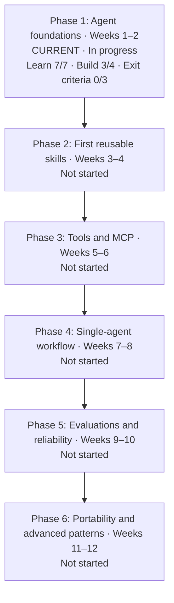

# AI Agent Learning and Skill-Development Roadmap

Calendar: Jalali (Solar Hijri), YYYY-MM-DD.

This is my personal, living roadmap for learning how AI agents work while building reusable skills for Codex, GPT-based agents, OpenCode, and other compatible tools.

## Current status

- Start date: 1405-06-09
- Target duration: 12 weeks
- Current phase: Phase 1 — Agent foundations
- Overall progress: 7 learning outcomes demonstrated and 3 writing/build outcomes completed; percentage deferred until milestone weights are defined
- Weekly study/build ratio: 30% study, 70% practice
- Next review date: YYYY-MM-DD
- Current evidence: Agent loop, context/instruction priority, prompts/persistent/repository instructions, tools/agent actions, permissions/safety, task scope/constraints/acceptance criteria, and reviewing diffs/verification evidence — Demonstrated
- Next checkpoint: Build 4 — complete the first of three bounded coding tasks when a project becomes available. Builds 1, 2, and 3 are complete as writing outcomes. Prioritize the starred build templates and worked examples below for future review. Independent verification design and defect-versus-missing-evidence diagnosis remain separate practice targets.
- Periodic review: Complete a Phase 1 retention and transfer assessment before marking the phase exit criteria complete; use `reviews/strengths-and-gaps.md` to select targeted checks.
- Current phase progress: Learn 7/7 demonstrated; Build 3/4 completed; Exit criteria 0/3 demonstrated.
- Schedule status: Estimated roadmap Week 2 (1405-06-16 to 1405-06-22), within the planned Phase 1 window; exact ahead/behind status is unknown because the weekly plan names broad focuses rather than measurable due outcomes.
- Evidence trend: Seven conceptual outcomes demonstrated and three writing outcomes completed across 11 reports (1405-06-10 to 1405-06-21). The learner authored review questions, applied them to username validation, and drafted reusable operating instructions with review feedback. Known-defect versus missing-evidence diagnosis remains an active gap; no new independent mastery or Retained evidence is claimed.

## Priority review: build templates and worked examples

**Starred by the learner for future review — 1405-06-19 (Jalali; Asia/Tehran).** The learner finds the build templates and concrete samples especially useful. Prioritize these when reviewing or preparing practical work; this is a learning preference, not a new assessment result.

| Priority material | Direct links | When to revisit |
|---|---|---|
| **Build 1 — reusable task-request template** | [Template](notes/task-specification-and-verification.md#combined-reusable-request-draft) · [Book-search example](notes/task-specification-and-verification.md#applied-build-practice-book-search-request) · [Reservation example](notes/task-specification-and-verification.md#applied-build-practice-reservations) | Before assigning a bounded coding task; adapt scope, expected behavior, and verification to the new request |
| **Build 2 — reusable code-review checklist** | [Final checklist](notes/reviewing-diffs-and-evidence.md#final-reusable-code-review-checklist) · [Username example and feedback](notes/reviewing-diffs-and-evidence.md#username-review-practice-first-response) · [Fix-versus-verify example](notes/reviewing-diffs-and-evidence.md#how-to-use-the-decision-rule) | Before accepting an agent's code change; compare requirements, changes, and actual evidence |

Future review approach: start with a saved template and one worked example, then apply it to a small new case if the learner wants practice. Keep useful templates and examples easy to find as later build items are completed. Earlier practice labels are historical; Builds 1, 2, and 3 are completed writing outcomes with coaching.

**Paused here:** Builds 1, 2, and 3 complete as writing outcomes. The learner chose hypothetical practice while no local project is available. The first [guided simulation](reports/1405-06-21-hypothetical-late-fees.md) is complete at Practiced level; no coding task was executed. Next: a fresh hypothetical review distinguishing an observed defect from missing verification. Build 4's three executed tasks remain pending.

## Visual progress roadmap

Snapshot: 1405-06-21 (Jalali; Asia/Tehran). Weeks show the planned sequence, not proof of completion. Status comes from the phase checkboxes and latest session evidence; no overall percentage is assigned.



### Phase 1 detail

Legend: ✓ Completed or demonstrated · ◐ In progress · ○ Not completed.

| Area | Visual progress | Recorded status |
|---|---|---|
| Learning outcomes | ✓ ✓ ✓ ✓ ✓ ✓ ✓ | 7/7 demonstrated |
| Build outcomes | ✓ ✓ ✓ ○ | 3/4 completed |
| Exit criteria | ○ ○ ○ | 0/3 demonstrated |

| Build item | Status | Remaining work |
|---|---|---|
| 1. Reusable task-request template | ✓ Completed | Independent verification design remains a separate practice target |
| 2. AI-generated-code review checklist | ✓ Completed | Writing criterion met with coach refinements; independent review-decision practice remains separate |
| 3. Draft project-independent agent operating instructions | ✓ Completed | Draft reviewed; writing outcome demonstrated without installation |
| 4. Three bounded coding tasks | ○ Not started | Complete tasks with explicit acceptance criteria and verification evidence |

Keep the checklist-writing outcome separate from the active learning gap: independently distinguishing a known defect from missing evidence. Revisit that gap during practical work or the Phase 1 review; do not require independent mastery merely to finish writing the checklist.

Evidence: [Latest session report](reports/1405-06-19-code-review-checklist-completed.md) · [Checklist draft and feedback](notes/reviewing-diffs-and-evidence.md) · [Strengths and gaps](reviews/strengths-and-gaps.md).

This is a saved snapshot. Refresh it alongside future roadmap status updates.

## Learning coach

- Skill: `agent-learning/skills/codex/agent-learning-coach/`
- Suggested invocation: `Use $agent-learning-coach to continue my roadmap.`
- Supervision model: infer progress from recorded evidence, confirm the position with me, teach documented gaps, reassess adaptively, and update progress only from demonstrated evidence.
- Gap notes: `learner/reza/notes/`
- Session reports: `learner/reza/reports/`
- Detailed step plans: `learner/reza/plans/`
- Exercises and artifacts: `learner/reza/experiments/`

## Main goals

- [ ] Understand the main components of an AI agent.
- [ ] Learn the difference between instructions, skills, tools, MCP servers, memory, and agents.
- [ ] Create reusable skills using a portable-core and platform-adapter approach.
- [ ] Build a small tool-using agent for a real project workflow.
- [ ] Measure skill and agent reliability with repeatable evaluations.
- [ ] Test selected skills with at least two agent environments.

## Working principles

1. Build narrow, testable skills instead of one large general-purpose skill.
2. Keep reusable workflow knowledge platform-neutral where practical.
3. Add a thin adapter for each agent platform only when necessary.
4. Treat scripts and tests as part of a skill, not just its written prompt.
5. Never trust a skill based only on one successful demonstration; evaluate it with multiple cases.
6. Prefer one observable agent with good tools before introducing multi-agent orchestration.

## Recommended directory structure

```text
agent-learning/
├── ROADMAP.md
├── notes/
├── experiments/
├── shared/
│   ├── references/
│   ├── scripts/
│   └── evals/
└── skills/
    ├── portable/
    ├── codex/
    ├── opencode/
    └── other-agents/
```

Create these subdirectories only when they are needed.

## Phase 1 — Agent foundations (Weeks 1–2)

### Learn

- [x] Explain the agent loop: observe, reason, act, inspect the result, and repeat.
- [x] Understand model context windows and instruction priority.
- [x] Understand prompts, persistent instructions, and repository instructions.
- [x] Learn how tools extend an agent beyond text generation.
- [x] Learn permissions, sandboxing, approvals, and destructive-action safety.
- [x] Practice defining task scope, constraints, and acceptance criteria.
- [x] Practice reviewing agent-generated diffs and verification evidence.

### Build

- [x] Write a reusable task-request template. — Writing criterion met through learner-authored draft and revisions with feedback; see `notes/task-specification-and-verification.md` and `reports/1405-06-17-task-request-template.md`. Independent verification design remains Practiced.
- [x] Write a checklist for reviewing AI-generated code. — Writing criterion met by the learner-authored draft and application, consolidated with coach refinements; see `notes/reviewing-diffs-and-evidence.md` and `reports/1405-06-19-code-review-checklist-completed.md`. Independent defect-versus-evidence diagnosis remains an active practice gap.
- [x] Draft project-independent agent operating instructions for bounded work, safety, and verification; review before reuse. — See `notes/agent-operating-instructions.md`.
- [ ] Complete three bounded coding tasks with explicit acceptance criteria.

### Exit criteria

- [ ] I can describe the components of an agent without referring to notes.
- [ ] I can give an agent a bounded task and obtain a verified result.
- [ ] I can identify unsafe or insufficiently verified agent behavior.

## Phase 2 — First reusable skills (Weeks 3–4)

### Learn

- [ ] Understand skill discovery and triggering.
- [ ] Define clear `use when` and `do not use when` conditions.
- [ ] Separate core instructions, references, scripts, assets, and examples.
- [ ] Understand progressive disclosure and context efficiency.
- [ ] Learn the relevant skill formats for Codex and OpenCode.

### Build

- [ ] Create `recording-lifecycle-auditor` as the first skill.
- [ ] Create `deepstream-pipeline-debugger`.
- [ ] Create `pytest-failure-diagnoser`.
- [ ] Add at least three realistic evaluation cases for each skill.

### Required content for every skill

- [ ] Purpose and scope
- [ ] Trigger conditions
- [ ] Non-trigger conditions
- [ ] Required inputs
- [ ] Deterministic workflow
- [ ] Safety constraints
- [ ] Expected output format
- [ ] Examples and evaluation cases

### Exit criteria

- [ ] At least one skill completes a real repository task successfully.
- [ ] Each skill has a narrow and explainable responsibility.
- [ ] Skill results are repeatable across several test cases.

## Phase 3 — Tools and MCP (Weeks 5–6)

### Learn

- [ ] Understand function/tool calling and JSON Schema.
- [ ] Distinguish read-only tools from mutating tools.
- [ ] Design approval boundaries for external actions.
- [ ] Understand MCP servers, clients, resources, and tools.
- [ ] Learn safe authentication and secret handling.
- [ ] Understand tool errors, retries, timeouts, and idempotency.

### Build

- [ ] Build a read-only DeepStream configuration inspection tool.
- [ ] Build a test-result summarization tool.
- [ ] Expose one safe repository diagnostic through a small MCP server.
- [ ] Add tests for invalid inputs and tool failures.

### Exit criteria

- [ ] I can explain the difference between a skill and a tool.
- [ ] My tools return structured, validated results.
- [ ] Mutating actions require explicit and appropriate authorization.

## Phase 4 — Build a single-agent workflow (Weeks 7–8)

### Learn

- [ ] Understand agent state and conversation history.
- [ ] Understand tool selection and execution loops.
- [ ] Learn basic guardrails and output validation.
- [ ] Add logging, traces, or another observable execution record.
- [ ] Learn when handoffs and orchestration are useful.

### Build

- [ ] Create a repository diagnostic agent that accepts a failing test or runtime error.
- [ ] Let it search relevant code and form a diagnosis.
- [ ] Let it run permitted read-only checks.
- [ ] Require evidence for its conclusion.
- [ ] Allow a bounded fix only under clear authorization.
- [ ] Require it to run focused verification and report results.

### Exit criteria

- [ ] The agent completes a full diagnose-and-verify loop.
- [ ] Every important action is observable.
- [ ] Failures are reported clearly instead of silently ignored.

## Phase 5 — Evaluations and reliability (Weeks 9–10)

### Learn

- [ ] Define task-level success criteria.
- [ ] Compare deterministic checks with model-based graders.
- [ ] Measure tool-selection and tool-argument correctness.
- [ ] Understand regression datasets.
- [ ] Track quality, latency, and cost trade-offs.

### Build

- [ ] Collect 15–30 evaluation cases from real repository work.
- [ ] Include normal cases, edge cases, and expected refusals.
- [ ] Create a repeatable evaluation command or checklist.
- [ ] Record a baseline before revising skills.
- [ ] Run regression evaluations after every material skill change.

### Exit criteria

- [ ] I can quantify whether a skill revision improved performance.
- [ ] Evaluations catch at least one real regression or unsafe behavior.
- [ ] Results are recorded and comparable over time.

## Phase 6 — Portability and advanced patterns (Weeks 11–12)

### Learn

- [ ] Separate portable workflow content from platform metadata.
- [ ] Understand context engineering, retrieval, and memory.
- [ ] Study prompt injection and untrusted tool output.
- [ ] Learn when multiple specialized agents provide measurable value.
- [ ] Understand handoffs, shared state, and orchestration failure modes.

### Build

- [ ] Run the same selected skill in Codex and OpenCode.
- [ ] Add adapters only for measured compatibility differences.
- [ ] Compare trigger accuracy, task success, unnecessary actions, and manual corrections.
- [ ] Attempt one small multi-agent experiment only after the single-agent baseline works.

### Exit criteria

- [ ] At least one skill works in two agent environments.
- [ ] Platform-specific differences are documented.
- [ ] Multi-agent complexity is justified by evaluation results.

## Initial skill backlog for this project

| Priority | Skill | Purpose | Status |
|---|---|---|---|
| 1 | `recording-lifecycle-auditor` | Trace recording creation, finalization, upload, retries, and deletion | Not started |
| 2 | `deepstream-pipeline-debugger` | Trace sources, elements, pads, queues, probes, and branches | Not started |
| 3 | `pytest-failure-diagnoser` | Reproduce, classify, diagnose, and report focused test failures | Not started |
| 4 | `custom-parser-reviewer` | Check tensors, bounds, class mappings, memory safety, and compatibility | Not started |
| 5 | `docker-runtime-verifier` | Validate services, images, mounts, GPU runtime, health checks, and logs | Not started |
| 6 | `safe-code-change-workflow` | Inspect, patch, test, and summarize without disturbing unrelated changes | Not started |

## Weekly progress log

Add one row at the end of every week.

| Week | Dates | Focus | Built or learned | Evidence | Problems | Next action |
|---|---|---|---|---|---|---|
| 1 | 1405-06-09 to 1405-06-15 | Agent foundations | Demonstrated agent loop, context/instruction priority, prompt placement, skill/tool distinctions, tool selection, verification before retries, and permissions/safety | `reports/1405-06-10-agent-loop.md`; `reports/1405-06-11-context-and-instructions.md`; `reports/1405-06-12-prompts-and-repository-instructions.md`; `reports/1405-06-14-tools-and-actions.md`; `reports/1405-06-15-permissions-and-safety.md` | Corrected earlier gaps; discarded answer-leaked tools quiz and passed fresh assessment | Practice task scope, constraints, and acceptance criteria |
| 2 | 1405-06-16 to 1405-06-22 | Agent foundations and Phase 1 evidence | Task specification and diff review demonstrated; task-request template and code-review checklist written with feedback | `reports/1405-06-16-task-specification.md`; `reports/1405-06-17-reviewing-diffs-and-evidence.md`; `reports/1405-06-17-task-request-template.md`; `reports/1405-06-19-code-review-checklist-practice.md`; `reports/1405-06-19-code-review-checklist-completed.md` | Independent verification design, defect-versus-missing-evidence diagnosis, and delayed retention pending | Draft project-independent agent operating instructions for review before reuse |
| 3 | | First skill | | | | |
| 4 | | Skill evaluation | | | | |
| 5 | | Tools | | | | |
| 6 | | MCP | | | | |
| 7 | | Agent workflow | | | | |
| 8 | | Observability and safety | | | | |
| 9 | | Evaluation dataset | | | | |
| 10 | | Regression evaluation | | | | |
| 11 | | Portability | | | | |
| 12 | | Advanced patterns and review | | | | |

## Evaluation scorecard

Use this table for every skill version. Score each measure from 0 to 5 unless it is a count or duration.

| Date | Skill/version | Trigger accuracy | Task success | Safety | Evidence quality | Unnecessary actions | Manual corrections | Duration/cost notes |
|---|---|---:|---:|---:|---:|---:|---:|---|
| | | | | | | | | |

## Decision log

Record important decisions so later changes have context.

| Date | Decision | Reason | Evidence | Revisit when |
|---|---|---|---|---|
| 1405-06-09 | Use a portable core with thin platform adapters | Avoid duplicating complete skills while allowing platform differences | Initial roadmap | After testing the first skill in two agents |

## Monthly review questions

- What can I now build or explain that I could not do last month?
- Which workflow did I repeat enough to justify turning it into a skill?
- Which skill produced the most reliable real-world value?
- Which failures came from instructions, missing context, tools, or the model?
- What did the evaluations reveal that casual testing missed?
- Am I adding complexity without measurable improvement?
- What should I stop, continue, or change next month?

## Immediate next actions

- [ ] Set the next review date in this document.
- [x] Complete the Phase 1 agent-loop learning item.
- [x] Complete the Phase 1 context and instruction-priority learning item.
- [x] Study prompts, persistent instructions, and repository instructions.
- [x] Study tools and agent actions.
- [x] Study permissions, sandboxing, approvals, and destructive-action safety.
- [x] Practice defining task scope, constraints, and acceptance criteria.
- [x] Write the reusable task-request template.
- [x] Write the AI-generated-code review checklist with coach refinements.
- [x] Draft project-independent agent operating instructions for review before reuse. — Completed as a reviewed writing outcome; see `notes/agent-operating-instructions.md` and `reports/1405-06-21-agent-operating-instructions.md`.
- [ ] Select one real recording-lifecycle problem as the first skill example.
- [ ] Draft three evaluation cases before implementing the first skill.
