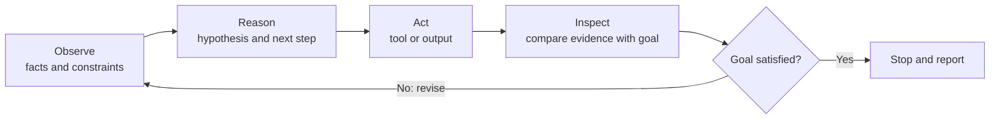

# Agent Loop

## Concept

An agent works through a feedback loop:



## Why it matters now

This loop is the foundation for understanding tools, permissions, verification, recovery, and orchestration. An agent is useful because it can act on observations and use the results as new evidence—not merely produce one text response.

## Essential mental model

1. **Observe:** Gather the request, constraints, current state, and relevant evidence.
2. **Reason:** Form or revise a hypothesis and choose the next safe, useful action.
3. **Act:** Perform that action through an available tool or produce the requested output.
4. **Inspect:** Examine the actual result instead of assuming the action succeeded.
5. **Repeat or stop:** Continue only when more evidence or work is required; otherwise report the outcome and limitations.

The stages are conceptual. An implementation may combine or rename them, but it still needs feedback from actions to make reliable progress.

## Model response versus agent loop

A model can answer a prompt once using only the context it already has. An agent wraps a model in a system that can gather new information, take actions through tools, observe the results, and decide what to do next.

```text
One model response:
request -> generated answer

Agent workflow:
request -> decision -> tool/action -> new evidence -> revised decision -> result
```

The model supplies reasoning and choices. The surrounding agent system supplies tools, permissions, state, execution, and the mechanism that feeds results back into the next decision.

## What each stage must produce

| Stage | Input | Useful output |
|---|---|---|
| Observe | Request, environment, evidence | Relevant facts, constraints, and unknowns |
| Reason | Current facts and objective | A hypothesis and the next safe action |
| Act | Selected action and permissions | A tool result or concrete artifact |
| Inspect | Actual action result | Evidence for or against the hypothesis |
| Repeat/stop | Evidence and completion criteria | Revised action, or a supported final report |

Good reasoning does not mean guessing the final answer immediately. It means choosing an action that reduces uncertainty while respecting scope and risk.

## Stopping conditions

An agent should stop when:

- the requested outcome and acceptance criteria are satisfied;
- enough evidence supports the requested diagnosis or answer;
- the next action needs permission the user has not granted;
- required information is unavailable and safe alternatives are exhausted; or
- further attempts would repeat the same action without gaining information.

It should not stop merely because a command exited successfully. It must connect the observed result to the objective.

## Safety boundaries inside the loop

Every loop iteration must preserve the task's authority and scope. A diagnostic request authorizes inspection, not an unrequested fix. A failed read-only check does not automatically authorize destructive cleanup, force-pushing Git history, changing production data, or exposing secrets.

Before a consequential action, the agent should know:

- whether the action is authorized;
- exactly what it will affect;
- whether the effect is reversible;
- how success will be verified; and
- when to stop or ask for help.

## Common mistake observed

Do not treat the numbered stages as answer choices. Each stage has a different responsibility, and a real task may pass through the loop several times.

Another common mistake is stopping after **Act**. A command running successfully does not prove the task succeeded; the agent must inspect its output and compare it with the objective.

## Small example

For a failing invoice-total test:

- Observe the request, failure output, relevant test, and permission to diagnose without editing.
- Reason about plausible causes and select a focused read-only check.
- Act by reading the calculation code or running the focused test.
- Inspect the output to see whether it supports the hypothesis.
- Repeat with a revised hypothesis, or stop and report the evidenced cause.

## Practice prompt

Map a new everyday or software problem to all five stages and identify one unsafe action.

## Self-check before assessment

You are ready for assessment when you can:

- explain why **Act** and **Inspect** are separate;
- turn a vague problem into a safe first observation;
- choose an action that tests a hypothesis;
- give an evidence-based stopping condition; and
- recognize an action that exceeds the user's authorization.

## Pass evidence

Independently explain the stages and apply them to a meaningfully different scenario, including a sensible stopping condition and one safety boundary.

## Summary

- An agent observes, reasons, acts, and inspects repeatedly until evidence supports stopping.
- Acting does not prove success; inspection compares the real result with the requested objective.
- Each iteration must preserve scope, permissions, and an explicit stopping condition.
