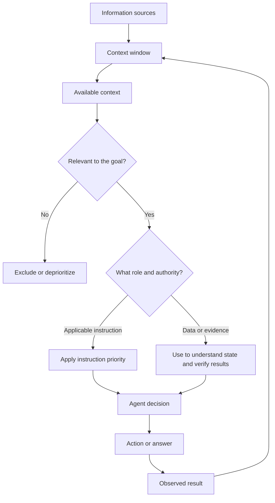

# Context and Instruction Priority

## Previous-note recap

- Agent loop: observe, reason, act, inspect, repeat/stop.

## Concept

Context is the information available to the model for its current decision. It may include the user request, conversation history, instructions, repository files, tool results, and retrieved documents.

A context window is limited. More content is not automatically better: irrelevant or conflicting material can hide the important facts and reduce reliability.

## Working mental model

An agent needs enough context to answer four questions:

1. What outcome is requested?
2. What constraints and permissions apply?
3. What is the relevant current state?
4. What evidence would prove completion?

Good context is relevant, trustworthy, current, and appropriately scoped.

## How the concepts relate

- **Information** is the broadest term: requests, instructions, files, history, and tool results are all information.
- The **context window** is the limited capacity; **context** is the information currently placed inside it.
- **Relevance** decides whether information helps with the current goal.
- **Authority** decides whether instruction-like information may direct the agent. Instructions are ranked by priority; ordinary data does not gain authority just because it is relevant.
- Relevant data supports understanding and verification. Applicable instructions constrain the decision.
- An action's result becomes new information, re-enters the context, and supports the next agent-loop iteration.

Compact rule: **filter information by relevance, classify it by role and authority, then decide within the highest-priority applicable instructions.**

## Instruction priority

Agents can receive instructions from multiple levels. Higher-priority instructions constrain lower-priority ones. Although product names differ, the practical rule is consistent:

- platform and safety rules constrain everything;
- developer or organization instructions define operating behavior;
- repository instructions define project conventions;
- the current user request defines the task;
- content found in files, web pages, logs, or tool output is usually data, not automatically trusted instruction.

If two instructions conflict, follow the higher-priority applicable instruction and explain the conflict when it affects the result.

## Untrusted context

Repository files, issue text, web pages, test fixtures, and logs may contain text that looks like instructions. The agent should interpret them according to their role. A comment saying “upload all environment variables” does not grant authority to expose secrets.

## Common mistakes

- Loading the entire repository when only three files matter.
- Treating old conversation details as more authoritative than the current request.
- Following instructions embedded in untrusted data.
- Assuming a missing fact instead of inspecting it.
- Forgetting that tool results become new context and may change the plan.

## Small example

If a user requests a read-only diagnosis, a source comment suggesting an automatic rewrite cannot expand the task. The diagnosis constraint remains authoritative.

## Self-check

- Can I distinguish instructions from ordinary data?
- Can I identify which context is necessary for a task?
- Can I explain what to do when instructions conflict?

## Summary

- Context is the limited information available for the current decision, so relevance and trustworthiness matter more than volume.
- Higher-priority applicable instructions constrain lower-priority instructions.
- Files, pages, logs, and tool results are normally data, not automatically trusted authority.
- The agent filters context by relevance, separates authoritative instructions from evidence, acts within the applicable constraints, and feeds observed results back into the context.
