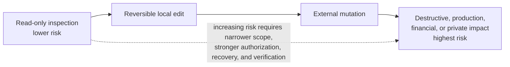

# Permissions and Safe Execution

## Previous-note recap

- Agent loop: observe, reason, act, inspect, repeat/stop.
- Context and instructions: relevant context, instruction priority, untrusted data.
- Prompts and repository instructions: task requests, persistent rules, appropriate scope.
- Tools and actions: capability, tool lifecycle, inspect results.

## Concept

Agent capability and agent authority are different. A tool may technically allow an action, but the agent should perform it only when the user has authorized that action within the task's scope.

## Permission dimensions

Before acting, consider:

- **Target:** Which exact files, systems, data, or people are in scope?
- **Operation:** Is the action read-only, reversible, mutating, or destructive?
- **Environment:** Is it local development, shared infrastructure, or production?
- **Impact:** Could the action lose data, expose secrets, spend money, or affect others?
- **Recovery:** Is there a reliable rollback or backup?
- **Verification:** How will the result be checked?

## Visual risk ladder

Capability answers **can the agent do it?** Authority answers **may the agent do it for this task?** Greater impact requires more exact authorization and a stronger recovery and verification plan.

## Sandboxes and approvals

A sandbox limits what an agent process can access. An approval allows a specific operation outside an existing boundary. Neither replaces careful reasoning:

- sandbox access does not imply user intent;
- approval for one command does not authorize unrelated actions;
- a broad technical capability should still be used narrowly; and
- when additional approval is needed, prepare an exact, reviewable action before requesting it;
- existing authorization remains valid within its scope; do not ask again merely because an action changes something; and
- user authorization does not automatically remove technical sandbox restrictions.

For example, “Explain why this folder is large” authorizes inspection, not deletion. “Remove the generated cache in this exact project folder” authorizes that bounded cleanup, subject to applicable execution restrictions. Before deleting, verify the resolved target and that its contents match the authorized cache. Access to neighboring folders does not authorize cleaning them too.

## Risk-based behavior

- Read-only inspection usually permits greater autonomy.
- Reversible local edits require verification and respect for unrelated work.
- External mutations require clear task authority.
- Destructive, irreversible, production, financial, or privacy-sensitive actions require exact targets and stronger confirmation.

## Common unsafe patterns

- Editing when asked only to diagnose.
- Force-pushing over remote work without inspection.
- Deleting broad directories identified through unresolved variables or globs.
- Printing secrets while debugging.
- Installing or contacting external services without authorization.
- Assuming a successful command means the broader operation was safe.

## Self-check

- Can I distinguish capability from authority?
- Can I identify when approval is required?
- Can I propose a safer, reversible alternative to a destructive action?

## Summary

- Capability is what an agent can technically do; authority is what the user permits it to do.
- Risk depends on the exact target, operation, environment, impact, recovery, and verification plan.
- Prefer narrow, read-only, reversible actions where suitable. Respect existing authorization and request any additional approval for a concrete action before executing it.
