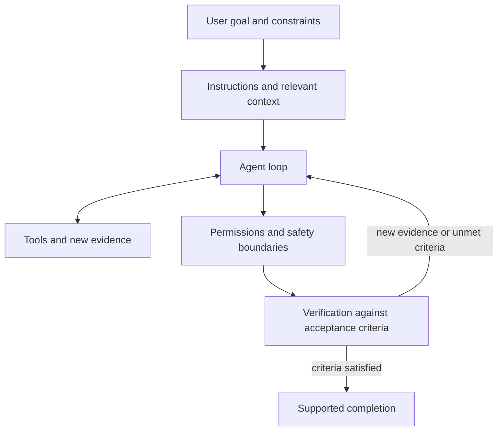

# Phase 1: Agent Foundations

## Purpose

Phase 1 builds the judgment needed to use coding agents safely and effectively. The goal is not to memorize product commands. It is to understand what an agent needs, what authority it has, how it should act, and how its work is verified.

## Suggested reading order

1. [Agent loop](agent-loop.md)
2. [Context and instruction priority](context-and-instructions.md)
3. [Prompts and persistent instructions](prompts-and-repository-instructions.md)
4. [Tools and agent actions](tools-and-actions.md)
5. [Permissions and safe execution](permissions-and-safety.md)
6. [Task specification and verification](task-specification-and-verification.md)

Read one topic at a time. After reading, ask questions before taking its three-level assessment.

## How the concepts connect

An agent can fail at any connection:

- an ambiguous goal leads to the wrong outcome;
- missing context leads to unsupported assumptions;
- conflicting instructions lead to incorrect priorities;
- unsuitable tools prevent reliable action;
- excessive permissions increase risk; and
- weak verification makes failure look like success.

## Phase 1 practical outputs

By the end of this phase, create:

- a reusable task-request template;
- a checklist for reviewing agent-generated work;
- a project-independent draft of agent operating instructions; and
- evidence from three bounded, verified coding tasks.

These artifacts demonstrate that the concepts can be applied, not merely explained.

## Phase exit standard

You should be able to:

- describe the major components of an agent without notes;
- give an agent a bounded task with clear authority and acceptance criteria;
- evaluate its actions and evidence; and
- identify unsafe, unauthorized, or insufficiently verified behavior.

## How the roadmap's Build sections work

Each phase separates learning concepts (Learn), producing usable artifacts or executed work (Build), and demonstrating the phase's broader abilities (Exit criteria). Build is the practical application of that phase's concepts; an artifact may be a document, code, tool, or evaluation record.

In Phase 1, the task-request template helps specify work before execution; the code-review checklist helps judge the result; project-independent operating instructions capture reusable guidance for bounded work, safety, and verification and remain unreused until reviewed; three bounded coding tasks provide experience specifying, running, and verifying real changes. The template, code-review checklist, and operating-instructions writing outcomes are complete with coaching. The three bounded coding tasks remain pending.

The learner authors drafts, makes decisions, and interprets evidence. The coach provides explanations, examples, feedback, and appropriately authorized execution support. A coach-written artifact alone does not establish learner competence. Completion follows the item's wording: writing a usable template can satisfy a writing outcome with feedback, while completing coding tasks requires actual task results and relevant verification evidence. Finishing Build does not automatically satisfy every exit criterion; independent understanding and the Phase 1 retention/transfer review still need evidence.

Later Build sections progress through reusable skills, tools and MCP, a single-agent workflow, repeatable evaluations, and portability with a justified advanced experiment. Work proceeds one useful outcome at a time, with prerequisites and evidence determining readiness.

## Summary

- Effective agent work connects a clear goal, relevant context, instructions, tools, permissions, and verification.
- Phase 1 develops judgment about what an agent should do, may do, and must verify.
- Build produces usable artifacts and practical evidence; completion follows each item's stated criterion.
- Build completion and phase-exit competence are assessed separately; reading alone does not establish either.
