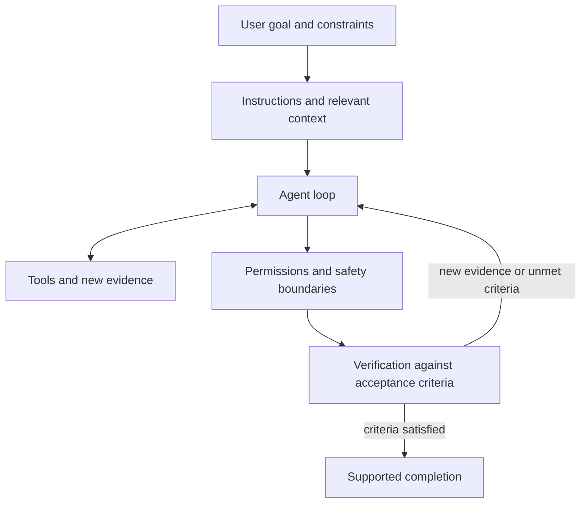

# Phase 1: Agent Foundations

## Purpose

Phase 1 builds the judgment needed to use coding agents safely and effectively. The goal is not to memorize product commands. It is to understand what an agent needs, what authority it has, how it should act, and how its work is verified.

## Suggested reading order

1. [Agent loop](agent-loop.md)
2. [Context and instruction priority](context-and-instructions.md)
3. [Prompts and persistent instructions](prompts-and-repository-instructions.md)
4. [Tools and agent actions](tools-and-actions.md)
5. [Permissions and safe execution](permissions-and-safety.md)
6. [Task specification and verification](task-specification-and-verification.md)

Read one topic at a time. After reading, ask questions before taking its three-level assessment.

## How the concepts connect

An agent can fail at any connection:

- an ambiguous goal leads to the wrong outcome;
- missing context leads to unsupported assumptions;
- conflicting instructions lead to incorrect priorities;
- unsuitable tools prevent reliable action;
- excessive permissions increase risk; and
- weak verification makes failure look like success.

## Phase 1 practical outputs

By the end of this phase, create:

- a reusable task-request template;
- a checklist for reviewing agent-generated work;
- a draft of project-level agent instructions; and
- evidence from three bounded, verified coding tasks.

These artifacts demonstrate that the concepts can be applied, not merely explained.

## Phase exit standard

You should be able to:

- describe the major components of an agent without notes;
- give an agent a bounded task with clear authority and acceptance criteria;
- evaluate its actions and evidence; and
- identify unsafe, unauthorized, or insufficiently verified behavior.

## Summary

- Effective agent work connects a clear goal, relevant context, instructions, tools, permissions, and verification.
- Phase 1 develops judgment about what an agent should do, may do, and must verify.
- Completion requires demonstrated understanding and practical evidence, not reading alone.
