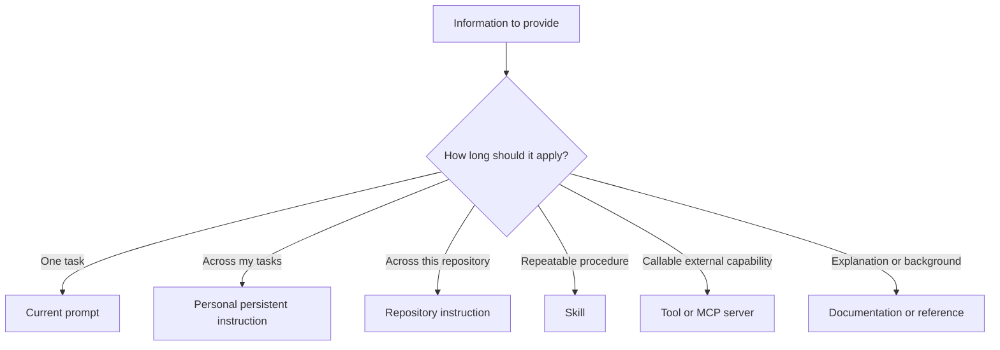

# Prompts and Persistent Instructions

## Previous-note recap

- Agent loop: observe, reason, act, inspect, repeat/stop.
- Context and instructions: relevant context, instruction priority, untrusted data.

## Concept

A prompt is task-specific communication given to a model or agent. Persistent instructions describe behavior that should apply across multiple tasks. Repository instructions describe conventions and workflows for a particular codebase or directory.

## Choosing the right location

| Information | Suitable location |
|---|---|
| One immediate objective | Current task prompt |
| Stable personal preference | Personal persistent instruction |
| Project build and test commands | Repository instruction file |
| Repeatable specialized workflow | Skill |
| External action capability | Tool or MCP server |
| Background explanation | Project documentation or skill reference |

Avoid copying the same rule into every prompt. Also avoid making temporary preferences permanent.

## Categories, not mandatory project folders

The locations in this note are possible homes for different kinds of information. They are not six files or directories that every project must contain.

- A current prompt normally exists in the conversation, not in the repository.
- Personal persistent instructions normally belong to the developer or agent environment, outside an individual project.
- Repository instructions and project documentation are often useful in a large codebase.
- Skills are justified by recurring specialized workflows.
- Tools are justified by actions the agent needs to execute.

An agent with repository access and file-search tools can usually discover conventional locations such as `tests/`, `src/api/`, or `docs/`. The prompt does not need to enumerate every relevant file. Repository instructions should document non-obvious layouts, authoritative commands, protected areas, and other rules that discovery alone cannot reliably establish.

## Skill versus tool

A **tool provides an executable capability**: search files, run a test, query an API, or edit a file. A **skill provides reusable workflow knowledge**: when to act, which tools to use, in what order, under which safety constraints, and how to verify the outcome.

Example: `pytest` is a tool that runs tests. A `pytest-failure-diagnoser` skill could tell an agent how to reproduce the smallest failure, inspect evidence, avoid unauthorized edits, rerun focused checks, and report the supported cause. One skill can coordinate several tools, and one tool can be used by many skills.

## Visual placement guide



Memory cue: **task now → prompt; stable project rule → repository instruction; repeatable process → skill; executable capability → tool.**

## A useful task prompt

A strong task request normally states:

- objective;
- relevant scope;
- constraints and exclusions;
- authorized actions;
- expected deliverable; and
- acceptance criteria.

Example:

```text
Diagnose why the focused invoice-total test fails.
Inspect only the relevant calculation and test files.
Do not edit files or change external services.
Report the supported cause, evidence, and remaining uncertainty.
```

## Repository instructions

Repository instructions should contain stable, non-obvious information that improves work across tasks, such as:

- authoritative test commands;
- architectural boundaries;
- formatting or validation requirements;
- generated files that must not be edited;
- project-specific safety rules; and
- definitions of completion.

Do not fill them with generic advice the agent already understands. Large instruction files consume context and make important rules harder to find.

## Common mistakes

- Combining several unrelated objectives in one request.
- Saying “fix everything” without boundaries.
- Describing implementation steps while omitting the desired outcome.
- Putting temporary task details into permanent repository instructions.
- Using a skill to store facts that belong in ordinary documentation.

## Self-check

- Can I decide whether information belongs in a prompt, repository instruction, skill, or documentation?
- Can I write acceptance criteria that can actually be checked?

## Summary

- Put immediate objectives in prompts, stable project rules in repository instructions, workflows in skills, and capabilities in tools.
- Strong task requests define scope, authority, expected output, and observable acceptance criteria.
- Persistent instructions should remain stable, concise, non-obvious, and useful across tasks.
- Treat these as information categories, not mandatory project folders; let agents discover conventional structure and document what is non-obvious.
- A tool performs an operation, while a skill guides a repeatable workflow and may coordinate several tools.
