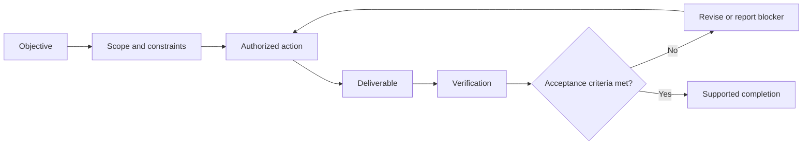
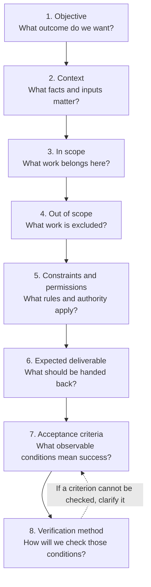

# Task Specification and Verification

## Previous-note recap

- Agent loop: observe, reason, act, inspect, repeat/stop.
- Context and instructions: relevant context, instruction priority, untrusted data.
- Prompts and repository instructions: task requests, persistent rules, appropriate scope.
- Tools and actions: capability, tool lifecycle, inspect results.
- Permissions and safety: authority, sandboxing, approvals, destructive-action caution.

## Concept

A bounded task tells the agent what success means and where its authority ends. Verification provides evidence that the requested outcome was achieved without unacceptable side effects.

## Visual completion chain



The chain is only as strong as its weakest link: an unclear objective produces the wrong work, broad scope permits drift, and weak verification makes unsupported completion claims possible.

## Task contract

Use this structure when assigning important work:

```text
Objective:
Context:
In scope:
Out of scope:
Constraints and permissions:
Expected deliverable:
Acceptance criteria:
Verification method:
```

Not every small task needs every heading, but the ideas should be clear.

### Does every skill need all eight headings?

These are useful design questions, not mandatory headings for every skill. A task contract describes one concrete assignment; a reusable skill describes how to handle a recurring class of assignments.

Put stable guidance in the skill: purpose, when to use it, boundaries, required inputs, workflow, permission rules, expected output, and appropriate success checks. Supply instance-specific details in the task request or obtain them from authorized context. Do not invent missing details that materially affect scope or correctness.

For example, a test-failure diagnosis skill can require a failing test or error output, define a diagnosis workflow, and require evidence in its report. The current request supplies which test failed, the repository, and whether fixing code is authorized. The skill's ability to describe a fix does not itself authorize editing code.

Combine or omit headings when the instructions remain clear. Acceptance criteria define the required result; verification methods define how to gather evidence that the result meets those criteria.

### Visual workflow: the eight components

Consider these eight components before implementation, using the detail the task needs. The arrows show a useful planning order; headings can be combined or omitted when the task remains clear.



For example: fix negative pagination limits → inspect endpoint behavior → change validation and tests → exclude pagination redesign → preserve the response format and add no dependencies → provide a patch and test report → negative limits return HTTP 400 and valid limits still work → run focused endpoint tests and inspect the diff.

## Acceptance criteria

Good acceptance criteria are observable. For example:

- the focused calculation tests pass;
- invoice rounding behavior remains unchanged;
- no unrelated files are modified;
- the report cites the relevant failure output; and
- unresolved uncertainty is stated explicitly.

“Works correctly” is weak because it does not define observable evidence.

### Discussion: response behavior versus deliverable

“Empty or whitespace-only search returns HTTP 400 with `Search text is required`” clearly defines an acceptance criterion. In a coding request, it also helps imply the deliverable: a code change implementing that behavior. A separate deliverable sentence is useful when the handoff needs clarification, but is not mandatory when context makes it clear.

- Deliverable: the code change, with a brief account of what changed and verification results.
- Acceptance criterion: the endpoint returns the specified status and message for both empty and whitespace-only input, while valid searches retain their behavior.
- Verification method: send requests for those cases and compare actual responses with expected responses, or run equivalent endpoint tests.

The endpoint response is the software's runtime output; the patch and verification results are the agent's handoff. These concepts can overlap in a concise request. Do not require repetitive wording merely to fill every template field.

### Completed practice request

Fix the affected search endpoint so empty or whitespace-only search text returns HTTP 400 with the message `Search text is required`. Preserve existing behavior for non-empty searches. Limit changes to the affected endpoint's validation and relevant tests. Add no dependencies and do not redesign search. Verify empty, whitespace-only, and known non-empty searches by sending requests and checking their responses, or running equivalent endpoint tests. Summarize the changes, checks performed, actual results, and any checks that could not run.

This request was refined through guided practice; the coach supplied the final wording and handoff summary. It is not independent assessment evidence.

### Build practice: a preservation boundary

The learner proposed: "don't change anything related to {}, unless necessary and after asking for authorization."

This establishes a protected area and a permission condition. A more precise reusable sentence is: "Leave [protected files, component, or behavior] unchanged. If the task requires changing it, explain why and obtain my authorization before making that change." Obtaining authorization matters: merely asking does not grant it. Name the protected area precisely when filling in the placeholder; preserving behavior and forbidding edits to a file are different constraints.

This is guided practice for the first Phase 1 Build item, not a formal assessment or a completed template.

### Build practice: an observable result

The learner proposed that the project should respond with a specified response to a specified request. This correctly pairs an input with an expected output: an acceptance criterion. Reusable wording: "When the system receives [request/input], it must return [expected response/output]." Fill in concrete response details where relevant, such as status, message, or value. For example, an unknown book ID must return HTTP 404 with `Book not found`.

This describes success; the verification method still needs to say how to check it.

### Build practice: verification through tests

The learner proposed: "all the tests in {tests location} should be passed." This specifies a test target and a required result. Turn it into an actionable method by saying to run the tests, and connect their assertions to the requested behavior: "Run the tests in [tests location] against the final changes. Ensure they cover [request/input] producing [expected response/output], adding or updating relevant tests if needed. Report the command, results, and any failed or skipped checks."

Passing existing tests alone may miss the requested behavior, as in the earlier boundary example. A test location should be appropriately scoped. An unrelated failure should be reported and investigated, not treated as authorization for unrelated fixes. This remains guided template-building practice, with no new assessment score or completed build item.

### Combined reusable request draft

The learner combined the pieces into a request identifying the bug's section, a protected section, the expected response for a request, and the test location. This is a usable guided draft. The remaining verification refinement is to ensure the tests assert the expected behavior and to report their actual results.

Refined template:

> Fix [describe bug] in [section X]. Do not change [section Y]. If completing the task requires a change outside the allowed scope, explain why, describe the proposed change, and obtain my explicit authorization before making it. When the system receives [request/input], it must return [expected response/output]. Run the tests in [tests location] against the final changes, ensuring they cover this expected behavior; add or update relevant tests if needed. Report what changed, the test results, and any failed or skipped checks.

The learner noticed that the combined wording omitted their earlier explicit permission step and requested its restoration. The template now states how to propose a necessary scope change. Necessity alone does not authorize it, and asking is not the same as receiving approval. The agent may continue independent authorized work while awaiting a decision. The coach supplied the verification refinement. Status: Practiced; independent application remains to be demonstrated before marking the build item complete. Next: fill in the template for one concrete bug, including the actual incorrect behavior and expected behavior.

### Applied build practice: book-search request

The learner applied the template to the book-search scenario, identifying the crash, expected HTTP 400 response, authentication boundary, explanation and confirmation before an exception, and `tests/search/`. After a targeted prompt, the learner added a test sending empty input and checking the required response. This completes the guided example; it remains Practiced rather than independent demonstration. The coach clarified empty search text versus an entirely empty request, corrected message spelling, and supplied explicit result-reporting wording.

Combined request:

> Fix the book-search endpoint crash when search text is empty. Return HTTP 400 with the exact message `Search text is required`. Leave authentication unchanged. If changing it is necessary, explain why and describe the proposed change, then obtain my confirmation before making it. Add a regression test that sends a request with empty search text and asserts both the status and message. Run the tests in `tests/search/` against the final changes and report the results, including any failed or skipped checks.

A regression test helps detect recurrence when run; it does not guarantee the bug can never return. Existing equivalent coverage can be updated rather than duplicated. No implementation or test execution was requested or performed in this exercise.

### Applied build practice: reservations

The learner independently specified the zero-quantity defect, allowed values 1 through 8, HTTP 400 with `Invalid quantity`, protected payment handling, and a zero-input regression test. After feedback, the learner corrected the test path to `tests/reservations/`, explicitly enumerated the allowed integers, and requested acceptance coverage plus nearby invalid inputs. The coach supplied exact boundary cases and final result-reporting wording.

Status remains Practiced: the request is usable after feedback, but full independent verification design has not yet been established. The review checklist is the next activity; retain the template's incomplete checkbox and revisit verification wording during bounded task work rather than treating the transition as completion. No code or tests were executed.

### Completion-record correction

The reusable-template writing item is complete: the learner authored a placeholder-based draft, revised it, and applied it to two concrete scenarios. Earlier Practiced labels describe the level of independent verification skill, but incorrectly kept the writing artifact checkbox open. Writing completion does not require an additional independent assessment. Preserve the feedback history above; independent verification design remains a practice target. See `../reports/1405-06-17-task-request-template.md`.

## Proportional verification

Verification effort should match risk:

- documentation edit: inspect the diff and rendered structure;
- focused bug fix: run the relevant test and inspect the diff;
- shared subsystem change: run focused and broader regression tests;
- production-affecting change: require stronger environment checks, rollout controls, and recovery planning.

## Reviewing agent-generated changes

Review at least:

1. **Scope:** Were only relevant files changed?
2. **Correctness:** Does the change address the actual cause?
3. **Safety:** Were permissions and project constraints respected?
4. **Regression risk:** What existing behavior could be affected?
5. **Evidence:** Were appropriate tests or inspections performed?
6. **Honesty:** Are failures, skipped checks, and uncertainty disclosed?

Tests are evidence, not proof. Passing tests may omit important behavior; failing tests may be unrelated. Interpret them in context.

## Common mistakes

- Asking for implementation before agreeing on the outcome.
- Letting the agent modify unrelated code during cleanup.
- Accepting a summary without inspecting the diff or test evidence.
- Running only a broad test suite when a focused failure needs diagnosis.
- Claiming completion when verification could not run.

## Self-check

- Can I turn a vague request into a bounded task contract?
- Can I choose verification proportional to risk?
- Can I identify insufficient or misleading completion evidence?

## Summary

- Use task-contract fields as design questions for skills, not a mandatory eight-heading format; separate reusable guidance from details of the current assignment.
- A bounded task defines its objective, scope, constraints, authority, deliverable, and acceptance criteria.
- Deliverables describe the work handed back; acceptance criteria describe conditions it must satisfy. Context can make a deliverable implicit.
- Verification should be observable and proportional to risk.
- Review agent work for scope, correctness, safety, regression risk, evidence, and honest uncertainty.
