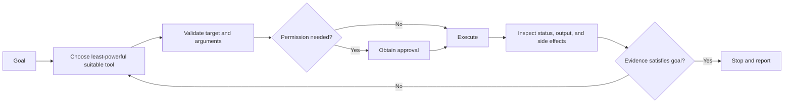

# Tools and Agent Actions

## Previous-note recap

- Agent loop: observe, reason, act, inspect, repeat/stop.
- Context and instructions: relevant context, instruction priority, untrusted data.
- Prompts and repository instructions: task requests, persistent rules, appropriate scope.

## Concept

A language model generates decisions and text. Tools let an agent observe or change systems outside the model, such as reading files, running tests, querying APIs, searching documentation, or editing code.

A skill teaches a workflow. A tool provides a capability. An agent combines reasoning, instructions, context, and tools in an execution loop.

## Tool lifecycle



A tool call is not successful merely because it ran. The returned result must be checked for errors, partial output, unexpected state, and relevance to the objective.

## Good tool design

A reliable tool has:

- a precise name and description;
- narrow, validated inputs;
- predictable, structured output;
- clear read-only or mutating behavior;
- useful error reporting;
- bounded execution and retry behavior; and
- safe handling of secrets.

Prefer the least powerful tool that can accomplish the required action. A read-only query is safer than a general shell when both provide the necessary evidence.

## Tool, skill, and MCP

- **Tool:** One callable capability, such as `run_test` or `read_camera_config`.
- **Skill:** Instructions and resources for completing a repeatable workflow.
- **MCP server:** A standard interface through which an agent can discover and call tools or access resources supplied by another system.

MCP does not make a tool trustworthy automatically. Permissions, authentication, output validation, and approval policies still matter.

## Clarifications from our discussion

### How do skills, agents, and tools work together?

The agent coordinates the work, a skill guides a reusable workflow, and tools execute specific operations. A skill does not run itself or automatically install the tools it mentions. An agent can use multiple skills and tools, or work directly from task instructions without a packaged skill.

For fruit shopping, a skill might say to check availability, compare total prices, stay within budget, and verify the order. The agent applies those instructions to today's request, calling store-search, inventory, ordering, and delivery tools as needed. Physical pickup requires a person, robot, or delivery service; software can arrange it through a tool.

In a game analogy, the agent is the player and the skill is a playbook. Tools are the available controls or actions: “move a piece” is closer to a tool than the piece itself. The player chooses an action and inspects the changed board. Separate rules and permissions constrain allowed actions.

### What do they look like, and where are they located?

Markdown is a file format, not a guarantee that a file is a skill. This file is a learning note. A skill's main instructions commonly live in `SKILL.md`, with optional scripts, examples, and references in the same skill package.

Tools are implemented as callable functions, programs, or services. Agent software connects a model, instructions, tools, and execution state in a loop. An illustrative project might contain:

```text
shopping-assistant/
  agent.py
  tools/
    find_stores.py
    check_inventory.py
  skills/
    fruit-shopping/
      SKILL.md
```

These filenames are examples, not required conventions. The agent code requests model decisions, executes permitted tool calls, returns their results to the model, and repeats until finished or stopped. The model may be accessed remotely through an API or loaded separately.

### Is the whole agent on a remote server?

An agent's components can run in different places. In our session, file-reading commands ran through PowerShell in the local Windows workspace, and the skill and learning notes were local files. The model was described as remotely hosted; this does not mean every tool executes remotely. A local file-reading result is returned to the model as context for its response.

Codex supports local repository work and separate cloud execution environments; exact placement depends on the selected environment and provider. See the [official Codex documentation](https://learn.chatgpt.com/docs/codex/cli), consulted on 2026-09-05.

### Why inspect results before retrying?

A successful query may return only part of the data, so check pagination before claiming a complete count. A timeout after a booking request leaves the outcome uncertain: the booking might have been created even though confirmation did not arrive. Check its state before retrying to avoid duplicate actions. If the state cannot be established, report the uncertainty rather than claim failure or blindly repeat the request.

## Common mistakes

- Calling tools before understanding the request.
- Using a mutating tool for diagnosis when read-only inspection is enough.
- Passing broad paths, globs, or unvalidated identifiers to destructive tools.
- Retrying the same failed action without changing anything.
- Ignoring truncated output or a nonzero exit status.

## Self-check

- Can I explain why a skill and a tool are different?
- Can I select a safe tool for a diagnostic task?
- Can I identify what must be inspected after a tool call?

## Summary

- A tool provides a callable capability, a skill teaches a workflow, and MCP exposes tools or resources through a standard interface.
- Safe tool use requires suitable selection, validated inputs, appropriate permission, and result inspection.
- A successful call is not task completion unless its result provides evidence for the objective.
- The agent coordinates; the skill guides; tools execute. Their files and running components may be distributed between local and remote environments.
- An uncertain outcome requires checking state before retrying an action that could create duplicates.
