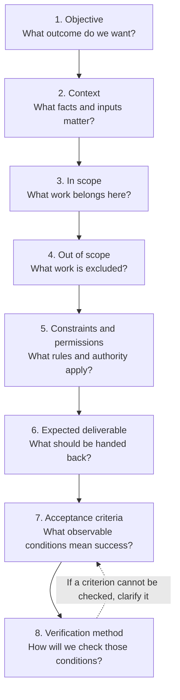

# Task Specification and Verification

## Previous-note recap

- Agent loop: observe, reason, act, inspect, repeat/stop.
- Context and instructions: relevant context, instruction priority, untrusted data.
- Prompts and repository instructions: task requests, persistent rules, appropriate scope.
- Tools and actions: capability, tool lifecycle, inspect results.
- Permissions and safety: authority, sandboxing, approvals, destructive-action caution.

## Bounded tasks

A bounded task defines success and where agent authority ends. Verification provides evidence that the requested outcome was achieved without unacceptable side effects.

Use this structure for important work:

```text
Objective:
Context:
In scope:
Out of scope:
Constraints and permissions:
Expected deliverable:
Acceptance criteria:
Verification method:
```

Small tasks may not need every heading, but the ideas should remain clear.

### Visual workflow: the eight components

Consider these eight components before implementation, using the detail the task needs. The arrows show a useful planning order; headings can be combined or omitted when the task remains clear.



For example: fix negative pagination limits → inspect endpoint behavior → change validation and tests → exclude pagination redesign → preserve the response format and add no dependencies → provide a patch and test report → negative limits return HTTP 400 and valid limits still work → run focused endpoint tests and inspect the diff.

## Acceptance criteria

Good criteria are observable, such as:

- focused tests pass;
- defined behavior remains unchanged;
- unrelated files are not modified;
- the report cites relevant evidence; and
- unresolved uncertainty is disclosed.

“Works correctly” is weak because it supplies no observable standard.

## Proportional verification

- Documentation edit: inspect the diff and rendered structure.
- Focused bug fix: run relevant tests and inspect the diff.
- Shared subsystem change: add broader regression checks.
- Production-affecting change: require environment checks, rollout controls, and recovery planning.

## Reviewing agent work

Review:

1. **Scope:** Were only relevant files changed?
2. **Correctness:** Does the change address the cause?
3. **Safety:** Were constraints and permissions respected?
4. **Regression risk:** What behavior could be affected?
5. **Evidence:** Were suitable checks performed?
6. **Honesty:** Are failures, skipped checks, and uncertainty disclosed?

Tests are evidence, not proof. Interpret passing and failing tests in context.

## Common mistakes

- Implementing before agreeing on the outcome.
- Allowing unrelated cleanup.
- Accepting a summary without diff or test evidence.
- Using broad tests instead of diagnosing a focused failure.
- Claiming completion when verification could not run.

## Self-check

- Can the learner turn a vague request into a task contract?
- Is verification proportional to risk?
- Is completion evidence sufficient and honest?

## Summary

- A bounded task defines its objective, scope, constraints, authority, deliverable, and acceptance criteria.
- Verification should be observable and proportional to the change's risk.
- Review agent work for scope, correctness, safety, regression risk, evidence, and honest disclosure of uncertainty.
